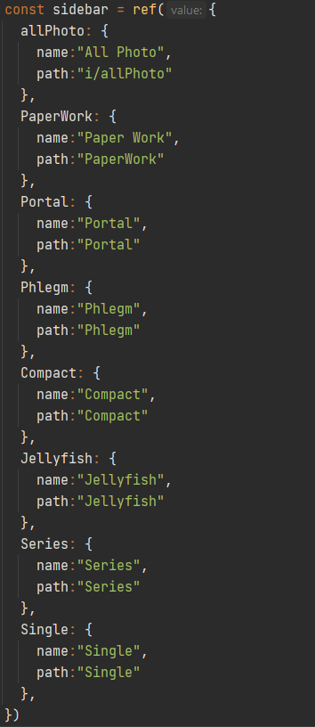
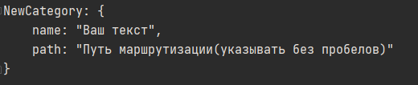

# client

## Project setup
```
npm install
```

### Compiles and hot-reloads for development
```
npm run serve
```

### Compiles and minifies for production
```
npm run build
```

### Lints and fixes files
```
npm run lint
```
****
### Изменение значения переменных 
**Типографика**

Путь: **src/main.css**

`:root { }`
- 
Тут храняться переменные стилей шрифта, от размера до толщины.

****

**Редактирование левого меню(Сайдбар)**

Путь: **src/components/Sidebar**



Находим данный раздел и редактируем объект

name, path - не изменяем

К примеру:



****
### Деплой (на Vercel и Heroku)
копируем команды: 
- npm run build
- git add . && git commit -m "new commit" && git push

И вставляем в терминал.
****
